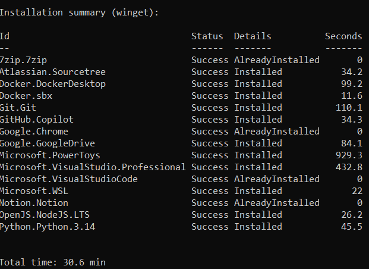

# InstallDefaults

Minimal, idempotent PowerShell setup script for a new Windows PC.

Default package source is Winget.

## What it installs by default

- Microsoft.VisualStudioCode
- Notion.Notion
- Google.Chrome
- Git.Git
- Atlassian.Sourcetree
- Microsoft.VisualStudio.Professional (or Community/Enterprise via parameter)
- Microsoft.NuGet
- 7zip.7zip
- GitHub.Copilot
- OpenAI.Codex
- Anthropic.Claude
- Anthropic.ClaudeCode
- Google.GoogleDrive
- OpenJS.NodeJS.LTS
- Python.Python.3.14
- Microsoft.PowerToys
- Microsoft.WSL
- Docker.DockerDesktop
- Docker.sbx
- GitHub.cli
- SlackTechnologies.Slack

## Behavior

- Idempotent: already installed packages are skipped.
- Failed or missing packages are retried on next run.
- Prints summary table with package id, status, details, and install time per package.

## Example Output



## Usage

Run default installation:

```powershell
Set-ExecutionPolicy Bypass -Scope Process -Force;
iex ((New-Object System.Net.WebClient).DownloadString('https://raw.githubusercontent.com/iarovyi/InstallDefaults/master/InstallDefaults.ps1')) -Verbose
```

Select Visual Studio edition for default list:

```powershell
Set-ExecutionPolicy Bypass -Scope Process -Force;
& $([scriptblock]::Create((New-Object Net.WebClient).DownloadString('https://raw.githubusercontent.com/iarovyi/InstallDefaults/master/InstallDefaults.ps1'))) -VisualStudioEdition Community -Verbose
```

Override package list with comma-separated Winget ids:

```powershell
$packages = "Git.Git,Microsoft.VisualStudioCode,Docker.DockerDesktop"
Set-ExecutionPolicy Bypass -Scope Process -Force;
& $([scriptblock]::Create((New-Object Net.WebClient).DownloadString('https://raw.githubusercontent.com/iarovyi/InstallDefaults/master/InstallDefaults.ps1'))) -Packages $packages -Verbose
```
